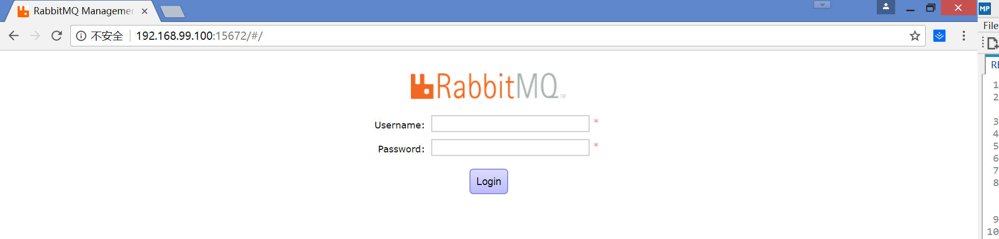

# rabbitmq项目说明 #
    通过Spring与SpringBoot两种方式整合，完成rabbitmq基本消息发送与结构功能

# 基于docker的rabbitmq环境安装 #
1. 获取镜像： docker pull rabbitmq:management
2. 执行镜像
docker run -d --name rabbitmq --publish 5671:5671 \
--publish 5672:5672 --publish 4369:4369 --publish 25672:25672 --publish 15671:15671 --publish 15672:15672 \rabbitmq:management
1. 查看docker容器ip:docker-machine ip
2. 根据获取的ip，在浏览器上访问:http://${ip}:15672 打开管理页面，则说明rabbitmq安装成功

# src/main/resource说明 #
1. config/rabbitmq/rabbitmq.properties是对rabbitmq的基本信息配置
2. spring目录是使用spring整合时的配置文件目录
3. springboot目录是使用springboot整合时的配置文件目录